# Obscura Trading Engine — Comprehensive Implementation Tasks

> [!IMPORTANT]
> **6 Phases · 42 Tasks · Estimated 8–12 weeks for a 2-person team**
> Tasks are ordered by dependency. Each task lists its deliverables, acceptance criteria, and SOLID principle it enforces.

---

## Phase 0: Infrastructure Foundation (Week 1)

### Task 0.1 — Docker Compose Skeleton
- **Owner:** DevOps
- **Files:** `docker-compose.yml`, `docker-compose.dev.yml`
- **Deliverable:** Working compose file with all 5 services (redis, questdb, rust-ingestor, python-engine, dashboard) on `trading_net` bridge network
- **Acceptance Criteria:**
  - `docker compose up redis questdb` starts both infra services
  - Redis: `--save 300 1 --loglevel warning`, memory limit 512M
  - QuestDB: volume mount `./data/questdb`, memory limit 2G, port 9000 exposed
  - JSON-file log rotation: max-size 10m, max-file 3 on ALL services
  - Resource limits match Section 7.3 budget exactly

### Task 0.2 — Environment & Secrets Management
- **Owner:** DevOps
- **Files:** `.env.example`, `.env.production`, `.gitignore`
- **Deliverable:** Complete env template with all required variables
- **Variables Required:**
  ```
  BYBIT_WS_URL, BYBIT_SYMBOLS, REDIS_URL, QUESTDB_ILP_HOST,
  QUESTDB_ILP_PORT, QUESTDB_HTTP_URL, TELEGRAM_BOT_TOKEN,
  TELEGRAM_CHAT_ID, ENGINE_LOG_LEVEL, API_PORT
  ```
- **Acceptance Criteria:** `.env.production` is in `.gitignore`, `.env.example` has placeholder values with comments

### Task 0.3 — Host Preparation Script
- **Owner:** DevOps
- **Files:** `infra/scripts/setup-host.sh`
- **Deliverable:** Bash script that configures Ubuntu 24.04 LTS host
- **Actions:** Set CPU governor to `performance`, set I/O scheduler to `mq-deadline`, install Docker + Compose, disable swap, configure UFW firewall (allow 80, 9000, 22 only)
- **Acceptance Criteria:** Idempotent — safe to run multiple times

### Task 0.4 — QuestDB Schema Init
- **Owner:** Backend
- **Files:** `infra/scripts/init-questdb.sql`
- **Deliverable:** SQL script creating the `klines` table
- **Schema:**
  ```sql
  CREATE TABLE IF NOT EXISTS klines (
      symbol SYMBOL, open DOUBLE, high DOUBLE, low DOUBLE,
      close DOUBLE, volume DOUBLE, timestamp TIMESTAMP
  ) TIMESTAMP(timestamp) PARTITION BY MONTH;
  ```
- **Acceptance Criteria:** Script runs idempotently via QuestDB REST API on container startup

---

## Phase 1: Rust Ingestor — "The Shield" (Weeks 2–3)

### Task 1.1 — Project Scaffold & Config
- **Owner:** Rust Dev
- **Files:** `services/ingestor/Cargo.toml`, `src/config.rs`, `src/main.rs`
- **Deliverable:** Compilable Rust project with env-based config
- **Dependencies:** `tokio`, `tungstenite`, `redis`, `serde`, `serde_json`, `dotenv`
- **Acceptance Criteria:** `cargo build --release` succeeds, config loads from env vars

### Task 1.2 — Exchange Trait (LSP)
- **Owner:** Rust Dev
- **Files:** `src/exchange_trait.rs`
- **Principle:** **Liskov Substitution** — any exchange client is swappable
- **Deliverable:**
  ```rust
  #[async_trait]
  pub trait ExchangeClient: Send + Sync {
      async fn connect(&mut self) -> Result<()>;
      async fn subscribe(&self, symbols: &[String], interval: &str) -> Result<()>;
      async fn next_message(&mut self) -> Result<KlineMessage>;
  }
  ```
- **Acceptance Criteria:** Trait compiles, `KlineMessage` struct defined with `symbol, open, high, low, close, volume, timestamp`

### Task 1.3 — Bybit WebSocket Client
- **Owner:** Rust Dev
- **Files:** `src/bybit_client.rs`, `src/ws_client.rs`
- **Deliverable:** Implements `ExchangeClient` for Bybit V5 Public WebSocket
- **Acceptance Criteria:**
  - Connects to `wss://stream.bybit.com/v5/public/linear`
  - Subscribes to `kline.5m.{symbol}` for configured symbols
  - Parses incoming JSON into `KlineMessage`
  - Handles ping/pong keepalive

### Task 1.4 — Exponential Backoff Reconnection
- **Owner:** Rust Dev
- **Files:** `src/backoff.rs`
- **Deliverable:** Generic backoff utility: 1s → 2s → 4s → 8s → max 60s
- **Acceptance Criteria:**
  - On disconnect, auto-reconnects with backoff
  - Resets delay to 1s on successful reconnection
  - Logs each attempt with timestamp and delay
  - Container never crashes — always retries

### Task 1.5 — Redis Stream Publisher
- **Owner:** Rust Dev
- **Files:** `src/redis_publisher.rs`
- **Deliverable:** Pushes every tick to Redis Stream `market:kline:5m`
- **Acceptance Criteria:**
  - Uses `XADD market:kline:5m * symbol {s} data {json}`
  - Maxlen trim: `MAXLEN ~ 10000` to prevent unbounded growth
  - Logs publish latency in debug mode

### Task 1.6 — QuestDB ILP Writer
- **Owner:** Rust Dev
- **Files:** `src/questdb_writer.rs`
- **Deliverable:** Writes closed candles via InfluxDB Line Protocol to TCP:9009
- **Acceptance Criteria:**
  - Only writes when candle `confirm == true` (closed candle)
  - Fire-and-forget TCP — never blocks the WS listener
  - Line format: `klines,symbol=BTCUSDT open=X,high=X,low=X,close=X,volume=X timestamp_nanos`

### Task 1.7 — Multi-Stage Dockerfile
- **Owner:** Rust Dev / DevOps
- **Files:** `services/ingestor/Dockerfile`
- **Deliverable:** Build in `rust:bullseye`, run in `debian:bullseye-slim`
- **Acceptance Criteria:** Final image < 50MB, non-root user, health check endpoint

### Task 1.8 — Integration Test
- **Owner:** Rust Dev
- **Files:** `services/ingestor/tests/integration_test.rs`
- **Deliverable:** Test that mocks Bybit WS, verifies Redis XADD and QuestDB ILP output
- **Acceptance Criteria:** `cargo test` passes in CI

---

## Phase 2: Python Engine — "The Brain" (Weeks 3–5)

### Task 2.1 — Project Scaffold & DIP Interfaces
- **Owner:** Python Dev
- **Files:** `requirements.txt`, `pyproject.toml`, `core/message_broker.py`, `core/event_bus.py`, `core/config.py`
- **Principle:** **Dependency Inversion**
- **Deliverable:**
  ```python
  class MessageBroker(Protocol):
      async def consume(self, stream: str, group: str) -> AsyncIterator[dict]: ...
      async def publish(self, channel: str, data: dict) -> None: ...
  ```
- **Dependencies:** `polars`, `redis[hiredis]`, `fastapi`, `uvicorn`, `aiohttp`, `pydantic-settings`
- **Acceptance Criteria:** Abstract interface defined, Pydantic config loads all env vars

### Task 2.2 — Redis Stream Consumer/Publisher
- **Owner:** Python Dev
- **Files:** `data_connectors/redis_client.py`
- **Principle:** **SRP** — only handles Redis I/O
- **Deliverable:** Implements `MessageBroker` for Redis Streams with consumer groups
- **Acceptance Criteria:**
  - Creates consumer group if not exists
  - `XREADGROUP` with block=5000ms
  - `XACK` after successful processing
  - Publishes enriched state to `state:{symbol}:score`

### Task 2.3 — QuestDB Read Client
- **Owner:** Python Dev
- **Files:** `data_connectors/questdb_client.py`
- **Deliverable:** HTTP-based query client for historical backfill
- **Acceptance Criteria:** Fetches last N candles for a symbol, returns as Polars DataFrame

### Task 2.4 — Base Indicator (OCP)
- **Owner:** Python Dev
- **Files:** `indicators/base_indicator.py`, `indicators/__init__.py`
- **Principle:** **Open/Closed**
- **Deliverable:**
  ```python
  class AbstractIndicator(ABC):
      @abstractmethod
      def name(self) -> str: ...
      @abstractmethod
      def compute(self, df: pl.DataFrame) -> pl.DataFrame: ...
  ```
- **Auto-discovery:** `__init__.py` dynamically imports all modules and registers indicators
- **Acceptance Criteria:** Adding a new `.py` file in `indicators/` auto-registers it

### Task 2.5 — Implement All 6 Indicators
- **Owner:** Python Dev
- **Files:** `indicators/ema.py`, `macd.py`, `vwma.py`, `stoch_rsi.py`, `bollinger_bands.py`, `atr.py`
- **Deliverable:** Each file implements `AbstractIndicator`, uses Polars vectorized ops (NO for loops)
- **Specs:**
  - **EMA:** 55-period and 200-period
  - **MACD:** (12, 26, 9)
  - **VWMA:** 20-period
  - **Stoch RSI:** 14-period
  - **Bollinger Bands:** (20, 2)
  - **ATR:** 14-period
- **Acceptance Criteria:** Unit tests with known input/output, all computations vectorized

### Task 2.6 — Base Rule (Strategy Pattern)
- **Owner:** Python Dev
- **Files:** `rules_engine/base_rule.py`
- **Principle:** **OCP + Strategy Pattern**
- **Deliverable:**
  ```python
  class AbstractRule(ABC):
      @abstractmethod
      def name(self) -> str: ...
      @abstractmethod
      def max_points(self) -> int: ...
      @abstractmethod
      def is_hard_rule(self) -> bool: ...
      @abstractmethod
      def evaluate(self, df: pl.DataFrame, direction: str) -> bool: ...
      @abstractmethod
      def get_points(self, df: pl.DataFrame, direction: str) -> int: ...
  ```
- **Acceptance Criteria:** Base class is abstract, cannot be instantiated directly

### Task 2.7 — Implement All 8 Rules
- **Owner:** Python Dev
- **Files:** `rules_engine/rule_bb_cross.py` through `rule_atr.py`
- **Deliverable:** Each rule in its own file, inherits from `AbstractRule`
- **Point Allocation:**

  | Rule | File | Points | Hard Rule? |
  |------|------|--------|------------|
  | BB Cross | `rule_bb_cross.py` | 20 | ✅ Yes |
  | Candle Confirm | `rule_candle_confirm.py` | 15 | ✅ Yes |
  | Volume | `rule_volume.py` | 15 | No |
  | MACD | `rule_macd.py` | 10 | No |
  | Stoch RSI | `rule_stoch_rsi.py` | 10 | No |
  | EMA Position | `rule_ema_position.py` | 15 | ✅ Yes |
  | VWMA Trend | `rule_vwma_trend.py` | 10 | No |
  | ATR | `rule_atr.py` | 5 | No |
  | **Total** | | **100** | |

- **Acceptance Criteria:** Sum of all max_points = 100, each rule independently testable

### Task 2.8 — Hard Rules Gate
- **Owner:** Python Dev
- **Files:** `rules_engine/hard_rules_gate.py`
- **Deliverable:** Filters rules where `is_hard_rule() == True`, returns REJECTED if any fail
- **Acceptance Criteria:** If ANY hard rule fails → immediate `{"status": "REJECTED", "score": 0}`

### Task 2.9 — Confidence Scorer (Dynamic)
- **Owner:** Python Dev
- **Files:** `rules_engine/confidence_scorer.py`
- **Deliverable:** Dynamically discovers all `AbstractRule` subclasses, runs gate → score → tier
- **Tiers:** `score >= 90` → ENTER FULL SIZE, `score >= 70` → ENTER SCALED SIZE, else NO TRADE
- **Acceptance Criteria:**
  - Adding a new `rule_*.py` file automatically includes it in scoring
  - No modification to this file required when extending rules

### Task 2.10 — Main Event Loop
- **Owner:** Python Dev
- **Files:** `core/main_loop.py`
- **Deliverable:** Async loop: consume Redis → build DataFrame → compute indicators → run scorer → publish state
- **Acceptance Criteria:**
  - Uses injected `MessageBroker` (not direct Redis import)
  - Graceful shutdown on SIGTERM
  - Logs processing latency per cycle

### Task 2.11 — Telegram Alert Dispatcher
- **Owner:** Python Dev
- **Files:** `alerts/telegram_notifier.py`, `alerts/alert_dispatcher.py`
- **Principle:** **SRP**
- **Deliverable:** Sends formatted JSON block to Telegram via `aiohttp`
- **Acceptance Criteria:**
  - Only triggers on PASS results
  - Includes: symbol, direction, score, decision, rule breakdown
  - Rate-limited: max 1 alert per symbol per 5 minutes

### Task 2.12 — FastAPI Gateway (ISP)
- **Owner:** Python Dev
- **Files:** `api/fastapi_app.py`, `api/routes.py`, `api/schemas.py`
- **Principle:** **Interface Segregation**
- **Endpoints:**
  - `GET /api/widgets/score/{symbol}` — Latest confidence score
  - `GET /api/widgets/scores` — All symbols' scores
  - `GET /api/history/{symbol}` — Historical klines for chart
  - `WS /ws/stream/{symbol}` — Live kline + score stream
- **Acceptance Criteria:** Pydantic response schemas, no raw Redis data leaked to frontend

### Task 2.13 — Python Dockerfile
- **Owner:** Python Dev / DevOps
- **Files:** `services/engine/Dockerfile`
- **Deliverable:** `python:3.11-slim`, installs only wheel deps, runs as non-root
- **Acceptance Criteria:** Image < 300MB, healthcheck on API port

### Task 2.14 — Unit & Integration Tests
- **Owner:** Python Dev
- **Files:** `tests/test_indicators.py`, `test_rules.py`, `test_confidence_scorer.py`
- **Acceptance Criteria:**
  - Each indicator tested with known OHLCV data
  - Each rule tested for both LONG and SHORT directions
  - Confidence scorer tested with mock rules returning known scores
  - All tests pass with `pytest -v`

---

## Phase 3: React Dashboard — "Obscura UI" (Weeks 5–7)

### Task 3.1 — Vite + React Project Init
- **Owner:** Frontend Dev
- **Files:** `services/dashboard/package.json`, `vite.config.js`, `index.html`
- **Deliverable:** Fresh Vite + React project with dependencies installed
- **Dependencies:** `react`, `react-dom`, `lightweight-charts`, `zustand`, `tailwindcss`
- **Acceptance Criteria:** `npm run dev` starts dev server, hot reload works

### Task 3.2 — Design System & Global Styles
- **Owner:** Frontend Dev
- **Files:** `src/styles/global.css`, `src/styles/glassmorphism.css`, `tailwind.config.js`
- **Deliverable:** Complete dark theme design system
- **Tokens:**
  - Background: `#0B0E14`
  - Panel glass: `bg-white/5 backdrop-blur-md`
  - Borders: `border border-white/10`
  - Text: `text-gray-300` (body), `text-white` (primary)
  - Bullish: `text-emerald-400` / Bearish: `text-rose-500`
- **Typography:** Inter or Outfit from Google Fonts
- **Acceptance Criteria:** All glass panels render with frosted blur effect on dark background

### Task 3.3 — AppShell Layout
- **Owner:** Frontend Dev
- **Files:** `components/layout/AppShell.jsx`, `Sidebar.jsx`, `TopBar.jsx`
- **Deliverable:** Main grid layout: sidebar (left) + top bar + content area + analysis panel (right)
- **Acceptance Criteria:** Responsive down to 1280px, sidebar collapsible

### Task 3.4 — GlassCard & Common Components
- **Owner:** Frontend Dev
- **Files:** `components/common/GlassCard.jsx`, `CircularProgress.jsx`, `StatusBadge.jsx`
- **Deliverable:** Reusable glassmorphism card, SVG circular progress, PASS/FAIL badges
- **Acceptance Criteria:** GlassCard accepts children, title, optional icon

### Task 3.5 — CoinWidget (TradingView Charts + Ref Bypass)
- **Owner:** Frontend Dev
- **Files:** `components/widgets/CoinWidget.jsx`
- **Deliverable:** Canvas-based candlestick chart using `lightweight-charts`
- **Critical Pattern (Section 6.2):**
  - Chart instance stored in `useRef`
  - Initial data loaded via REST `/api/history/{symbol}`
  - Live ticks pushed via `candleSeriesRef.current.update()` — **NO setState**
- **Acceptance Criteria:**
  - Chart renders initial history on mount
  - Live ticks update chart without React re-render
  - Transparent background, grid matches Obscura theme

### Task 3.6 — WebSocket Hook with Backoff
- **Owner:** Frontend Dev
- **Files:** `hooks/useWebSocket.js`, `hooks/useMarketStream.js`
- **Deliverable:** Generic WebSocket hook with exponential backoff reconnection
- **API:** `const { liveTick, confidenceScore, status } = useMarketStream('BTCUSDT')`
- **Acceptance Criteria:**
  - Auto-reconnects on disconnect (1s, 2s, 4s…)
  - Cleans up connection on unmount
  - Exposes connection status ('connecting', 'connected', 'disconnected')

### Task 3.7 — Zustand Stores
- **Owner:** Frontend Dev
- **Files:** `stores/marketStore.js`, `stores/scoreStore.js`
- **Deliverable:** Lightweight state stores for market data and confidence scores
- **Acceptance Criteria:** Stores update only on meaningful data changes, no unnecessary re-renders

### Task 3.8 — Analysis Panel (Confidence Score UI)
- **Owner:** Frontend Dev
- **Files:** `panels/AnalysisPanel.jsx`, `HardRulesGate.jsx`, `RuleChecklist.jsx`
- **Deliverable:** Right-hand panel showing:
  1. Circular progress bar mapping `total_score` (0–100)
  2. Hard Rules Gate with red/green shield icons
  3. Dynamic checklist: ✅ PASS / ❌ FAIL for each rule
- **Acceptance Criteria:**
  - Maps over `rules_payload` array from backend
  - Color-coded: emerald for pass, rose for fail
  - Animates score changes with smooth transition

### Task 3.9 — PriceTickerBar & ScoreGauge
- **Owner:** Frontend Dev
- **Files:** `widgets/PriceTickerBar.jsx`, `widgets/ScoreGauge.jsx`
- **Deliverable:** Scrolling price ticker strip at top, animated circular score gauge
- **Acceptance Criteria:** Ticker auto-scrolls, gauge animates on value change

### Task 3.10 — Alert Log Panel
- **Owner:** Frontend Dev
- **Files:** `panels/AlertLogPanel.jsx`
- **Deliverable:** Live feed of alerts/trades with timestamps, filterable by symbol
- **Acceptance Criteria:** Shows last 50 alerts, auto-scrolls to newest, glassmorphism styled

### Task 3.11 — Nginx Config & Dockerfile
- **Owner:** Frontend Dev / DevOps
- **Files:** `nginx/default.conf`, `services/dashboard/Dockerfile`
- **Deliverable:**
  - Nginx: serve static files, reverse-proxy `/api` → `python-engine:8000`, WebSocket upgrade for `/ws`
  - Dockerfile: Node build stage → `nginx:alpine` serve stage
- **Acceptance Criteria:** Final image < 20MB, gzip enabled, cache headers for static assets

### Task 3.12 — REST API Service Layer
- **Owner:** Frontend Dev
- **Files:** `services/api.js`, `services/websocket.js`
- **Deliverable:** Clean API client with fetch wrappers, error handling
- **Acceptance Criteria:** All API calls go through this layer, not directly from components (ISP)

---

## Phase 4: Integration & End-to-End (Week 7–8)

### Task 4.1 — Full Stack Smoke Test
- **Owner:** All
- **Deliverable:** `docker compose up` brings all 5 services online
- **Acceptance Criteria:**
  - Rust connects to Bybit WS → publishes to Redis
  - Python consumes from Redis → computes score → publishes state
  - Dashboard loads → fetches history → receives live WebSocket updates
  - Confidence Score panel renders live rule evaluations

### Task 4.2 — WebSocket Proxy Integration
- **Owner:** DevOps / Frontend
- **Deliverable:** Nginx properly proxies WebSocket connections from browser → Python engine
- **Acceptance Criteria:** WS connection survives for 1+ hour without dropping

### Task 4.3 — Telegram Alert E2E Test
- **Owner:** Backend
- **Deliverable:** Full pipeline: market data → score PASS → Telegram message received
- **Acceptance Criteria:** Formatted message includes symbol, direction, score, all 8 rule results

### Task 4.4 — Failure & Recovery Testing
- **Owner:** DevOps
- **Acceptance Criteria:**
  - Kill Redis → Python engine reconnects automatically
  - Kill Bybit WS → Rust reconnects with backoff
  - Kill Python → Docker restarts it, resumes from last Redis offset
  - OOM simulation: Python stays within 2GB limit

---

## Phase 5: Hardening & Deploy (Weeks 8–9)

### Task 5.1 — Deploy Script
- **Owner:** DevOps
- **Files:** `infra/scripts/deploy.sh`
- **Deliverable:** One-command deployment: `git pull → docker compose build → docker compose up -d`
- **Acceptance Criteria:** Zero-downtime deploy on the edge server

### Task 5.2 — Database Backup Script
- **Owner:** DevOps
- **Files:** `infra/scripts/backup-db.sh`
- **Deliverable:** Cron-compatible script that snapshots QuestDB data directory
- **Acceptance Criteria:** Compresses to tar.gz, rotates keeping last 7 backups

### Task 5.3 — Monitoring & Health Checks
- **Owner:** DevOps
- **Deliverable:** Docker health checks on all services
- **Acceptance Criteria:** `docker compose ps` shows all services as "healthy"

### Task 5.4 — Security Hardening
- **Owner:** DevOps
- **Acceptance Criteria:**
  - All containers run as non-root
  - Only ports 80 and 9000 exposed to host network
  - No secrets in Docker images or git history
  - Redis not exposed outside `trading_net`

---

## Phase 6: Documentation (Ongoing)

### Task 6.1 — README.md
- **Owner:** Lead Dev
- **Deliverable:** Project overview, quickstart, architecture diagram, env var reference

### Task 6.2 — Developer Onboarding Guide
- **Owner:** Lead Dev
- **Files:** `docs/developer-guide.md`
- **Deliverable:** How to add a new rule, how to add a new indicator, how to add a new exchange

### Task 6.3 — Runbook
- **Owner:** DevOps
- **Files:** `docs/runbook.md`
- **Deliverable:** Troubleshooting guide: common failures, recovery procedures, log locations

---

## Dependency Graph

```mermaid
graph TD
    P0["Phase 0: Infrastructure"] --> P1["Phase 1: Rust Ingestor"]
    P0 --> P2["Phase 2: Python Engine"]
    P0 --> P3["Phase 3: React Dashboard"]
    P1 --> P4["Phase 4: Integration"]
    P2 --> P4
    P3 --> P4
    P4 --> P5["Phase 5: Hardening"]
    P5 --> P6["Phase 6: Documentation"]

    style P0 fill:#1e3a5f,stroke:#4a9eff
    style P1 fill:#3a1e5f,stroke:#9a4aff
    style P2 fill:#1e5f3a,stroke:#4aff9a
    style P3 fill:#5f3a1e,stroke:#ff9a4a
    style P4 fill:#5f1e3a,stroke:#ff4a9a
    style P5 fill:#3a5f1e,stroke:#9aff4a
    style P6 fill:#1e5f5f,stroke:#4affff
```



> [!TIP]
> **Phases 1, 2, and 3 can run in parallel** since they only share the infrastructure from Phase 0. Assign Rust, Python, and Frontend devs to work simultaneously.

---

## Key Extension Points (Phase 2 — Future AI)

When adding AI predictions later, the team only needs to:

1. Create `indicators/ai_prediction.py` (extends `AbstractIndicator`)
2. Create `rules_engine/rule_ai_prediction.py` (extends `AbstractRule`)
3. Spin up a new AI container that reads from the same Redis stream
4. **Zero changes** to `main_loop.py`, `confidence_scorer.py`, or any existing rule files

This is the **Open/Closed Principle** working at both the code and infrastructure level.
